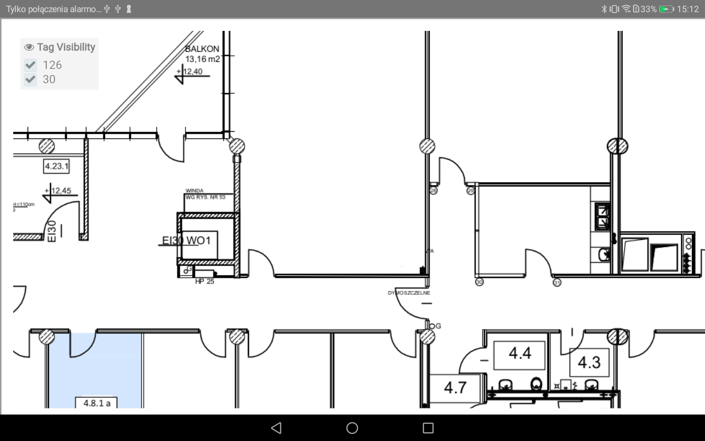

# __INMap object__

The INMap object is the main object to communicate with the frontend server. INMap object corresponds to the floor you want to display.
It inherits WebView object and provides his basic functionality. All other objects are created corresponding to given INMap object and they require a INMap instance.

INMap can be called only if `onINMapReady` invoked, after that, you can create map instance and load floor plans.

```java
inMap = (INMap) findViewById(R.id.inMap);

public void onINMapReady(INMap mapView) {
   inMap.createMap("http://mybuilding.com", "apiKey", height, width);
    inMap.load(floorId);
    }
```




Additionaly you can use method `load` with callback method as a second argument:

```java
inMap.load(floorId, new OnObjectReadyCallback() {
			@Override
			public void onReady(Object o) {
				Log.i("Indoor", "INMap is ready to use");
			}
		});
```


## __Usage__

As a developer you can download the list of available complexes with buildings and floors.

```java
inMap.getComplex(new OnReceiveValueCallback<List<Complex>>() {
			@Override
			public void onReceiveValue(List<Complex> complexes) {
				Log.i("Indoor", "Complex: " + complexes.get(0).name);
			}
		});
```

If map created on the frontend server have published paths, you can pull given point to the nearest corresponding place on path.
```java
inMap.pullToPath(new Position(600, 600, 1, new Date()), 1, new OnReceiveValueCallback<Point>() {
			@Override
			public void onReceiveValue(Point point) {
				Log.e("indoor", "pulled point: " + point);
			}
		});
```

