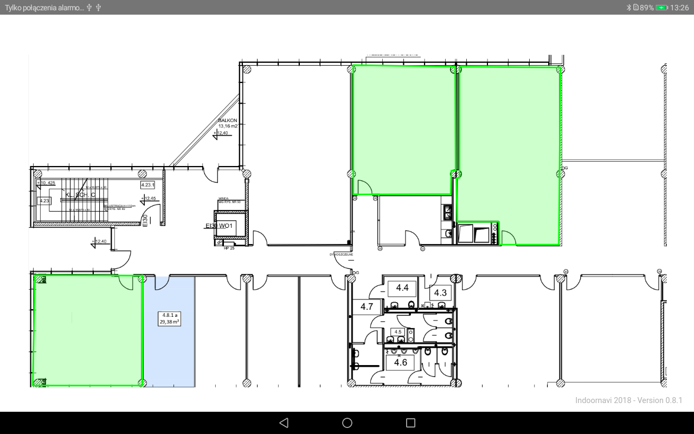

# __Map Objects__

To create an object you have to use object builder pattern.
All properties has native getters. 

## __INPolyline__

An INPolyline is a series of connected points, which represents a path.
Points should be given in real-world dimensions. Additionally, you can specify the color of the created path.

```java
INPolyline inPolyline = new INPolyline.INPolylineBuilder(inMap)
    .setPoints(points)
    .setColor(Color.LTGRAY)
    .build();
```

<br>

<br>

## __INArea__

An INArea is a closed area, defined with a series of points which starts and ends at the same point.
Points should be given in real-world dimensions. Additionally, you can change color and opacity of the created area.

```java
INArea inArea = new INArea.INAreaBuilder(inMap)
    .setPoints(points)
    .setColor(Color.GREEN)
    .setOpacity(0.3)
    .build();
```

It's possible to add an EventListener to the INArea object. An event is invoked after clicking on the area.

```java
inArea.addEventListener(new OnINObjectClickListener() {
	@Override
	public void onClick() {
		Toast.makeText(this, "Event!", Toast.LENGTH_LONG).show();
	}
});
```

Additionaly you can check if given coordinates are located inside area.

```java
inArea.isWithin(new Coordinates(200, 800, (short)109999, new Date()), bool -> Log.i("Indoor", "Is within: " + bool));
```

Optional you can receive middle point of the area by colling:
```java
inArea.getCenterPoint();
```

<br>

<br>

## __INMarker__

An INMarker represents a single location on the map. You can customize your marker by changing the default icon and adding your own label.
Additionally, you can a add click event on the marker and proper actions.

```java
INMarker inMarker = new INMarker.INMarkerBuilder(inMap)
    .setPosition(new Point(600, 600))
    .setIcon("https://cdn0.iconfinder.com/data/icons/small-n-flat/24/678111-map-marker-512.png")
    .setLabel("This is label")
    .build();
```

It's possible to add an EventListener to the Marker object. An event is invoked after clicking on the marker.

```java
inMarker.addEventListener(new OnINObjectClickListener() {
    @Override
        public void onClick() {
            Toast.makeText(this, "Hello!", Toast.LENGTH_LONG).show();
        }
    });
```

## __INInfoWindow__

For INMarker object, you can add INInfoWindow. An info window allows you to display necessary information.
Additionally, you can set the height and width of the window, custom content and position according to the marker you display on.
Content can be simple HTML code, it gives you a possibility to design your own unique message.

```java
INInfoWindow inInfoWindow = new INInfoWindow.INInfoWindowBuilder(inMap)
    .setHeight(100)
    .setWidth(100)
    .setContent("<h2>Lorem ipsum dolor sit amet</h2>")
    .setPositionAt(INInfoWindow.Position.TOP)
    .build();
```

You can attach an info window to a marker:
```java
inMarker.addInfoWindow(inInfoWindow);
```

<br>

<br>

## INCircle

An INCircle object represents a circle which can map a specific location. 
It has the ability to change the color and radius of the circle and customize the border set on the circle.

```java
INCircle inCircle = new INCircle.INCircleBuilder(inMap)
	.setPosition(new Point(600, 600))
	.setRadius(8)
	.setOpacity(0.3)
	.setColor(Color.RED)
	.setBorder(new Border(30, Color.GREEN))
	.build();
```
<br>

<br>

## __Objects properties__
You can retrieve some information about an object, like:

#### ID
Returns ID of the given object. ID identify object on the backend server.
```java
inPolyline.getID(id -> { Log.i("MyTag", "ID: " + id); });
```
#### remove
All objects can be removed from frontend server.
Calling this method will clear the data of this object.
```java
inArea.remove();
```
